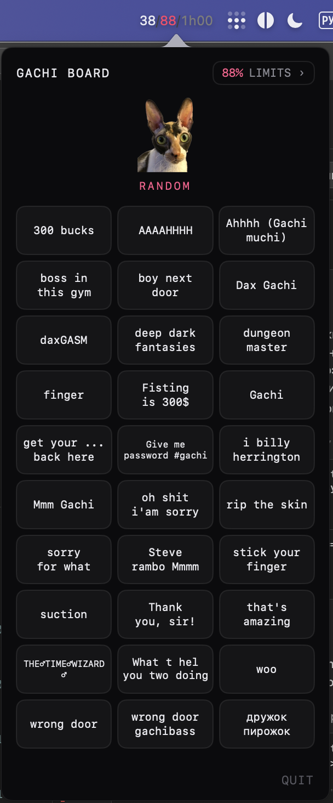
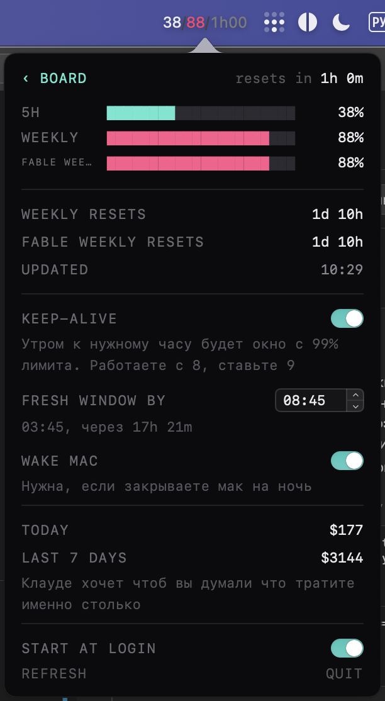

# claude limits gachi soundboard

[English below](#english)

Гачи-саундборд в строке меню макоса. Заодно показывает лимиты Claude Code и умеет
будить Claude ночью, чтобы к твоему пробуждению у тебя было 99% 5часового лимита и час до закрытия окна.

## что умеет

- саундборд: жмёшь кошку, играет случайный гачи звук. или тыкаешь конкретный на сетке
- лимиты Claude прямо в строке меню: 5-часовое окно, недельный, сколько до сброса
- keep-alive: в нужное время стартует клаудекоде окно, чтобы к нужному часу у тебя было 99% лимита и час до закрытия окна.
  работаешь с 8, ставишь 9
- трата в долларах по тарифам API, считается локально из транскриптов

Строка меню всегда показывает лимиты. По клику открывается борд, лимиты вторым
экраном. Зайдёшь в лимиты хоть раз, дальше открывается сразу на них.

## скрины

 

## поставить

взять LimitNotifier.zip из [релизов](https://github.com/marblecake88/claude-limits-gachi-soundboard/releases), распаковать, перетащить в /Applications.
нужен установленный и залогиненный Claude Code, цифры берутся из него.

## собрать самому

    ./make-app.sh release install

нужен только xcode command line tools, зависимостей нет.

## лицензия

код под MIT, звуки принадлежат их авторам.

---

## English

Gachi soundboard for the macOS menu bar. It also shows your Claude Code limits and wakes
Claude overnight so by the time you wake up you have 99% of the 5-hour limit and an hour before the window closes.

### what it does

- soundboard: click the cat for a random gachi, or tap a specific one on the grid
- Claude limits right in the menu bar: 5-hour window, weekly, time to reset
- keep-alive: starts a claude-code window at the set time, so by your hour you have 99% of the limit
  and an hour before it closes. you start at 8, set it to 9
- spend in dollars at API rates, computed locally from transcripts

The menu bar always shows limits. Click opens the board, limits are the second screen.
Once you open limits, next time it opens straight to them.

### install

grab LimitNotifier.zip from [releases](https://github.com/marblecake88/claude-limits-gachi-soundboard/releases), unzip, drag to /Applications.
you need Claude Code installed and logged in, the numbers come from it.

### build

    ./make-app.sh release install

only xcode command line tools, no dependencies.

### license

code is MIT, sounds belong to their authors.
