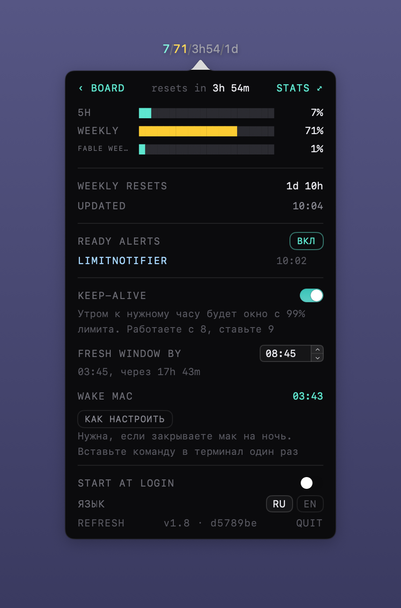
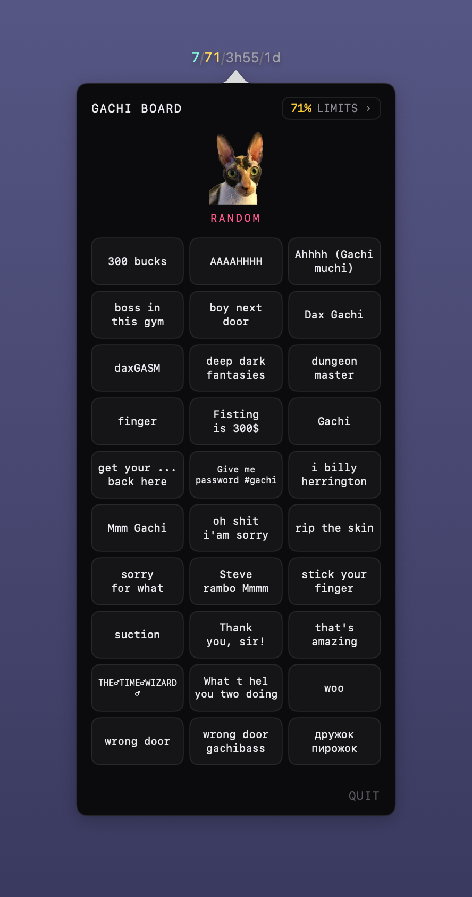
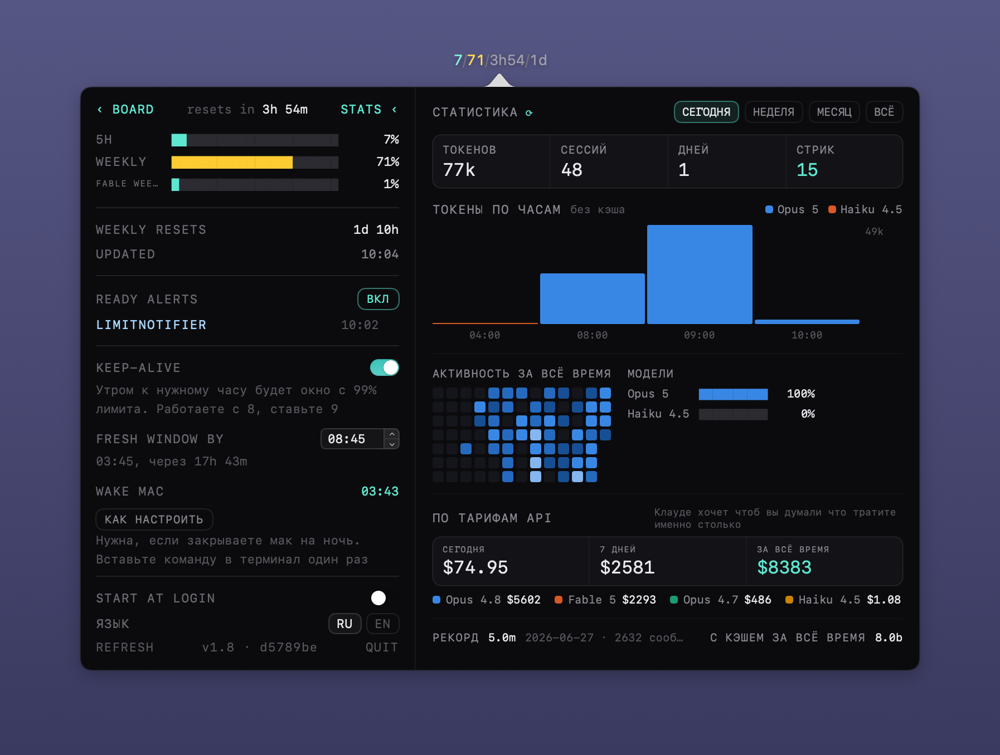

# claude limits gachi soundboard

[English below](#english)

Лимиты Claude Code в строке меню мака. Зовёт, когда claude в другом окне закончил работу.
Будит claude ночью, чтобы к твоему пробуждению было свежее окно. Заодно гачи-саундборд.

## что умеет

**Лимиты всегда на виду.** В строке меню `84/34/1h07/4d`: 5-часовое окно, недельный лимит,
сколько осталось до сброса каждого. Цифры меняют цвет на 60, 79 и 89 процентах, так что
край видно не читая. Данные берутся из самого claude, никаких токенов на это не тратится.

**Не пропадает, когда в строке меню нет места.** У JetBrains и Xcode меню длинное, и macOS
молча выкидывает иконки, которые не влезли. Если нас выкинуло, цифры сами переезжают в
плавающую плашку и так же сами возвращаются, когда место освободилось. Плашка висит поверх
всего, на всех рабочих столах и в полноэкранном режиме, где строки меню нет вообще.
Перетаскивается мышкой, по клику открывает ту же панель, бегущая строка в ней та же.
Тумблером в панели её можно держать постоянно.

**Зовёт, когда claude закончил.** Работаешь в одном окне, claude пилит задачу в другом.
Закончил и ждёт тебя, а ты этого не видишь. Включаешь READY ALERTS, и строка меню
прокручивает имя проекта: лимиты уезжают влево, за ними едут имена. Клик по имени в панели
переносит к тому окну, включая переключение рабочего стола. Если ты и так смотришь в это
окно, приложение молчит.

**Будит claude ночью.** Пятичасовое окно открывается первым запросом, а не по расписанию.
Значит если начать работать в девять, окно закроется в два, посреди дня. Keep-alive
поджигает пустое окно заранее, чтобы к нужному тебе часу лимит был полным: работаешь с 8,
ставишь 9. Если мак спит, приложение подскажет команду для будильника.

**Статистика.** Жмёшь STATS, и панель разъезжается вправо: токены по дням, часам или
неделям, карта активности за всё время, доли моделей, стрики. Плюс деньги по тарифам API,
за сегодня, за неделю и за всё время, с разбивкой по моделям. Считается локально из
транскриптов и кэша claude, цифры сходятся с его собственной вкладкой Stats.

**Гачи-саундборд.** Тридцать звуков. Жмёшь кошку, играет случайный, или тыкаешь конкретный
на сетке. Ради этого всё и затевалось.

Строка меню всегда показывает лимиты. По клику открывается борд, лимиты вторым экраном.
Зайдёшь в лимиты хоть раз, дальше открывается сразу на них. Интерфейс на английском, если
система не русская, переключатель RU/EN в панели.

## скрины

 

Статистика разъезжается вправо по кнопке STATS:

## поставить

через brew:

    brew trust marblecake88/tap
    brew install --cask marblecake88/tap/claude-limits-gachi-soundboard

trust нужен один раз, свежий homebrew иначе не грузит каски из сторонних тапов.

или руками: взять LimitNotifier.zip из [релизов](https://github.com/marblecake88/claude-limits-gachi-soundboard/releases), распаковать, перетащить в /Applications.

нужен macos 14 и установленный залогиненный Claude Code, цифры берутся из него.
когда выходит новая версия, приложение само пишет об этом в углу панели.

## поставить с нуля на чистом маке

если нет ни brew, ни claude code, всё ставится одной пачкой:

    # homebrew
    /bin/bash -c "$(curl -fsSL https://raw.githubusercontent.com/Homebrew/install/HEAD/install.sh)"

    # claude code, без него цифр не будет
    brew install --cask claude-code

    # войти в аккаунт: откроется браузер
    claude

    # само приложение
    brew trust marblecake88/tap
    brew install --cask marblecake88/tap/claude-limits-gachi-soundboard
    open /Applications/LimitNotifier.app

homebrew в конце установки печатает пару команд про PATH, их надо выполнить,
иначе brew не найдётся в новой вкладке терминала.

## обновить без brew

если brew не стоит, обновление одной пачкой в терминале:

    pkill -f LimitNotifier.app
    cd ~/Downloads
    curl -L -o LimitNotifier.zip https://github.com/marblecake88/claude-limits-gachi-soundboard/releases/latest/download/LimitNotifier.zip
    unzip -oq LimitNotifier.zip
    rm -rf /Applications/LimitNotifier.app
    mv LimitNotifier.app /Applications/
    open /Applications/LimitNotifier.app

настройки лежат отдельно и переустановку переживают. ссылка всегда ведёт на свежий релиз.

## собрать самому

    ./make-app.sh release install

нужен только xcode command line tools, зависимостей нет.

## лицензия

код под MIT, звуки принадлежат их авторам.

---

## English

Claude Code usage limits in the macOS menu bar. Calls you when claude finishes in another
window. Wakes claude overnight so your window is fresh by morning. Plus a gachi soundboard.

### what it does

**Limits always visible.** `84/34/1h07/4d` in the menu bar: the 5-hour window, the weekly
limit, and time until each resets. Numbers change colour at 60, 79 and 89 percent, so you
see the edge without reading. Data comes from claude itself and costs no tokens.

**Does not disappear when the menu bar runs out of room.** JetBrains IDEs and Xcode have long
menus, and macOS silently drops the icons that no longer fit. If we get dropped, the numbers
move to a floating plaque on their own, and move back once there is room again. The plaque
sits above everything, on every desktop and in fullscreen, where there is no menu bar at all.
Drag it where you like, click it to open the same panel, same marquee inside. A switch in the
panel keeps it on permanently.

**Calls you when claude is done.** You work in one window while claude grinds away in
another. It finishes, waits for you, and you never notice. Turn on READY ALERTS and the menu
bar scrolls the project name past: limits slide out to the left, names follow. Clicking a
name in the panel takes you to that window, switching desktops if needed. If you are already
looking at that window, the app stays quiet.

**Wakes claude overnight.** The 5-hour window opens on your first request, not on a
schedule, so starting at nine means it closes at two, in the middle of your day. Keep-alive
burns an empty window early, so the limit is full by the hour you choose: start at 8, set 9.
If your mac sleeps, the app hands you the command for a wake timer.

**Statistics.** Hit STATS and the panel expands to the right: tokens per day, hour or week,
an activity map for all time, model shares, streaks. Plus spend at API rates for today, the
week and all time, broken down by model. Computed locally from transcripts and claude's own
cache, and the numbers match its Stats tab.

**Gachi soundboard.** Thirty sounds. Click the cat for a random one, or tap a specific one
on the grid. This is what the whole thing was built for.

The menu bar always shows limits. Click opens the board, limits are the second screen. Once
you open limits, next time it opens straight to them. The UI is English unless your system
is Russian, with an RU/EN switch in the panel.

### screenshots

 

Statistics expand to the right when you hit STATS:

### install

via brew:

    brew trust marblecake88/tap
    brew install --cask marblecake88/tap/claude-limits-gachi-soundboard

trust is a one-time thing, recent homebrew won't load casks from third-party taps otherwise.

or by hand: grab LimitNotifier.zip from [releases](https://github.com/marblecake88/claude-limits-gachi-soundboard/releases), unzip, drag to /Applications.

needs macos 14 and Claude Code installed and logged in, the numbers come from it.
when a new version ships, the app says so in the corner of the panel.

### install from scratch on a clean mac

no brew, no claude code, one paste:

    # homebrew
    /bin/bash -c "$(curl -fsSL https://raw.githubusercontent.com/Homebrew/install/HEAD/install.sh)"

    # claude code, the numbers come from it
    brew install --cask claude-code

    # sign in, opens a browser
    claude

    # the app itself
    brew trust marblecake88/tap
    brew install --cask marblecake88/tap/claude-limits-gachi-soundboard
    open /Applications/LimitNotifier.app

homebrew prints a couple of PATH commands at the end, run them, otherwise brew
won't be found in a new terminal tab.

### update without brew

no brew, no problem, one paste in the terminal:

    pkill -f LimitNotifier.app
    cd ~/Downloads
    curl -L -o LimitNotifier.zip https://github.com/marblecake88/claude-limits-gachi-soundboard/releases/latest/download/LimitNotifier.zip
    unzip -oq LimitNotifier.zip
    rm -rf /Applications/LimitNotifier.app
    mv LimitNotifier.app /Applications/
    open /Applications/LimitNotifier.app

settings live elsewhere and survive the reinstall. the link always points at the newest release.

### build

    ./make-app.sh release install

only xcode command line tools, no dependencies.

### license

code is MIT, sounds belong to their authors.
